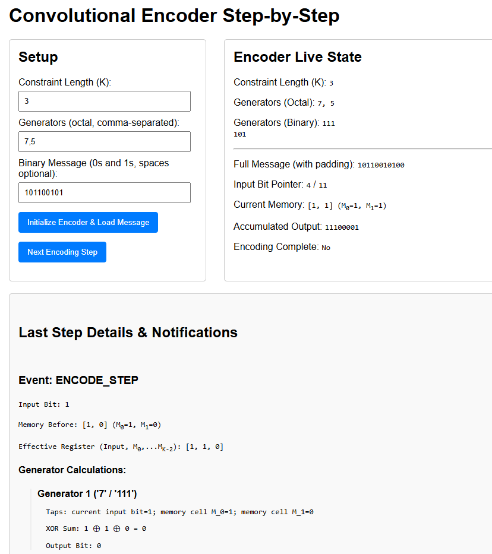
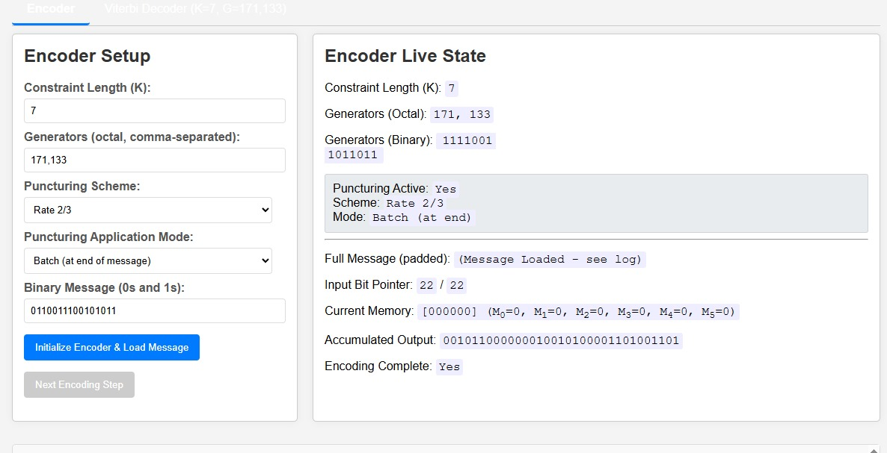
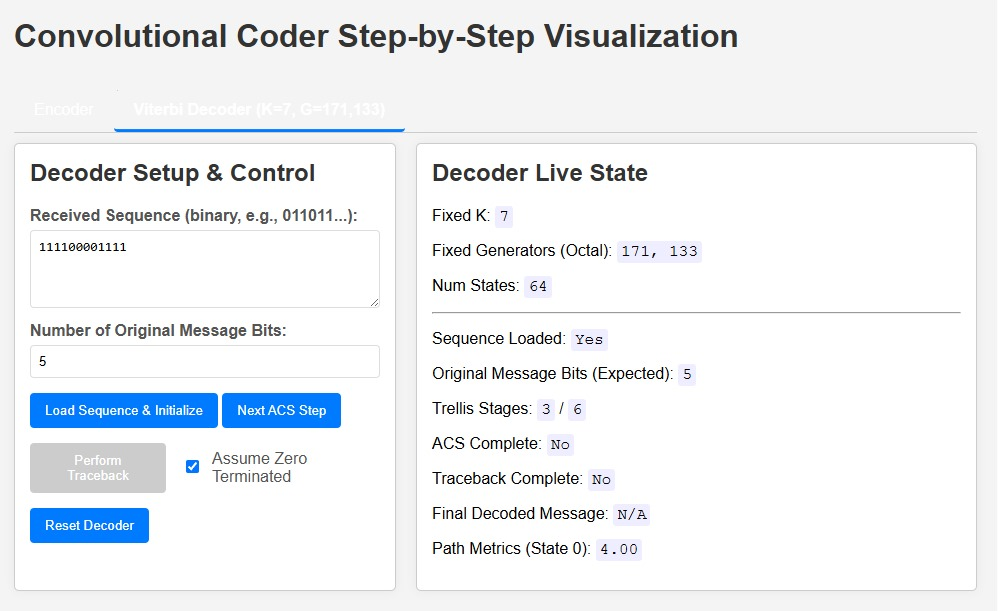
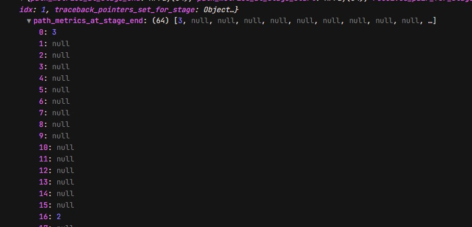

# Flask Convolutional Encoder and Viterbi Decoder

This application implements a simple convolutional encoder and Viterbi decoder using the Flask web framework. It allows users to input a binary data string, encode it using a pre-defined convolutional code, optionally introduce noise (simulated), and then decode the (potentially noisy) data using the Viterbi algorithm to attempt to recover the original message.

## Screenshot



## Features

*   **Web Interface:** User-friendly interface built with Flask, featuring separate tabs for Encoder and Viterbi Decoder operations.
*   **Convolutional Encoding (with Puncturing):**
    *   Encodes a user-provided binary string.
    *   **Configurable Parameters:** Allows setting constraint length (K) and generator polynomials (octal).
    *   **Puncturing Support:**
        *   Offers selection from predefined puncturing schemes (e.g., Rate 1/2 (None), 2/3, 3/4, 4/5, 5/6, 7/8) compatible with a rate 1/2 mother code.
        *   Supports two puncturing application modes:
            *   **On-the-fly:** Puncturing is applied to each symbol as it's generated.
            *   **Batch (at end):** The entire message is encoded first (unpunctured), and then puncturing is applied to the complete block of unpunctured symbols.
        *   UI clearly indicates the active puncturing scheme and mode.
    *   **Step-by-Step Operation:** Allows users to process the input message bit by bit.
        *   Displays current memory state, input bit, effective register contents.
        *   Shows detailed calculation for each generator.
        *   Clearly distinguishes between *unpunctured output* for the step and the *punctured bits* (if any) added to the final stream.
        *   Live updates of the accumulated (potentially punctured) output.
    *   **Event Logging:** Provides detailed event notifications for message loading, each encoding step (including puncturing details), puncturer configuration changes, and encoding completion.
*   **Viterbi Decoding:**
    *   Decodes a received binary sequence to recover the original message.
    *   **Fixed Parameters:** Tailored for a rate 1/2 mother code with K=7, Generators "171", "133" (octal). (Note: This decoder expects an *unpunctured* input stream corresponding to this mother code).
    *   **Step-by-Step Operation:**
        *   **Load Sequence:** Accepts received sequence and number of original message bits.
        *   **ACS Phase Visualization:** Step through Add-Compare-Select stages, with UI updates for current stage, path metrics (summary for State 0, full details in console), and event logs.
        *   **Traceback Phase:** Execute traceback with option for "Assume Zero Terminated," displaying the final decoded message.
    *   **Live State Display:** Shows if sequence is loaded, trellis progress, ACS/Traceback completion status.
    *   **Event Logging:** Detailed events for decoder reset, sequence loading, ACS steps, and traceback.
*   **Noise Simulation (Conceptual):** The overall application structure allows for future integration of a noise channel between the encoder output and decoder input (currently a manual step if desired).
*   **Clear Output Comparison (Conceptual):** While not a direct feature of the step-by-step tools, the separate encoder/decoder allows users to encode, (manually transfer/modify for noise), and then decode, facilitating comparison of original vs. decoded.

---

## Screenshots

### Encoder Tab with Puncturing

The Encoder tab allows users to configure the convolutional encoder, including setting the constraint length, generator polynomials, and a binary message. Crucially, it now features controls for selecting a **Puncturing Scheme** (e.g., "Rate 2/3") and a **Puncturing Application Mode** ("On-the-fly" or "Batch"). The "Live State" section reflects these settings, and the "Last Step Details" provide insights into both unpunctured and punctured outputs during step-by-step encoding.

 

---

### Viterbi Decoder Tab in Action

The Viterbi Decoder tab is designed for step-by-step decoding of (unpunctured) received sequences for the fixed K=7, G=["171","133"] code. Users can load a sequence, step through the ACS (Add-Compare-Select) phase stage by stage observing path metric updates, and finally perform traceback to get the decoded message. The image below shows an example of the decoder mid-operation.

 


### Also it can offer debug events to the user

 


## Prerequisites

*   Python 3.7+
*   pip (Python package installer)
*   Git (for cloning the repository)

## Getting Started

Follow these instructions to get a copy of the project up and running on your local machine for development and testing purposes.

### Installation

1.  **Clone the repository:**
    ```bash
    git clone <your-repository-url>
    cd <repository-name>
    ```

2.  **Create and activate a virtual environment (recommended):**
    ```bash
    # For Windows
    python -m venv venv
    .\venv\Scripts\activate

    # For macOS/Linux
    python3 -m venv venv
    source venv/bin/activate
    ```

3.  **Install dependencies:**
    (Assuming you have a `requirements.txt` file. If not, you'll need to create one or install Flask manually.)
    ```bash
    pip install Flask
    # If you have a requirements.txt:
    # pip install -r requirements.txt
    ```
    *Note: Based on the provided OCR, the core encoder/decoder logic might be in separate Python files (e.g., `quantum_encoder.py`, `viterbi_decoder.py`). Ensure these are correctly imported by your Flask app file (e.g., `app.py`).*

### Running the Application

1.  **Start the Flask development server:**
    (Assuming your main Flask application file is named `app.py`)
    ```bash
    python app.py
    ```
    Or, if you've set up `FLASK_APP`:
    ```bash
    flask run
    ```

2.  **Open your web browser** and navigate to:
    ```
    http://127.0.0.1:5000/
    ```
    (The port might be different if specified in your Flask app configuration.)

## How to Use

1.  Enter a binary string (e.g., `10110`) into the "Binary Input" field.
2.  Click the "Encode & Decode" button (or similar, based on your UI).
3.  The application will:
    *   Display the "Encoded Output."
    *   Show the "Received (Noisy) Output." (You might manually alter this field if you want to simulate errors before decoding, or the app might have a feature for this).
    *   Present the "Decoded Output" from the Viterbi decoder.
    *   Indicate if the decoded message matches the original input.